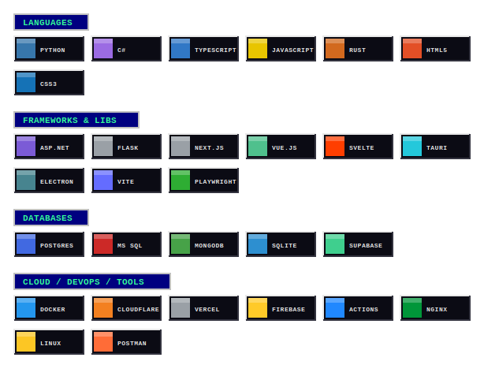

<!--
  ███  jadrianports — GitHub Profile README (90s WEB EDITION)  ███
  Commit ALL of these into the jadrianports/jadrianports repo:
    README.md · welcome-wordart.svg · marquee.svg · globe.svg
    techstack.svg · synthwave-cat.gif
  Everything is self-hosted (no rot-prone hotlinks).
-->

<div align="center">

<!-- ░░░ MICROSOFT WORDART HEADER (committed, animated SVG) ░░░ -->


<!-- ░░░ ANIMATED SCROLLING MARQUEE (committed SVG) ░░░ -->


`★·.·´¯·.·★  J A M E S   A D R I A N   P O R T E R  ★·.·´¯·.·★`

<sub>🌟 𝕊𝕠𝕗𝕥𝕨𝕒𝕣𝕖 𝔻𝕖𝕧𝕖𝕝𝕠𝕡𝕖𝕣 🌟 · Cebu, Philippines · est. on the information superhighway</sub>

<!-- ░░░ VISIT MY WEBSITE — flanked by spinning 90s globes ░░░ -->
<a href="https://portsmith.vercel.app/jadrianports/">&nbsp;&nbsp;</a>

</div>

<div align="center">


</div>


Hi there. 👋 I architect **Python API integrations** that wire CRMs, productivity suites, and serverless guts together, build **resilient ETL & scraping pipelines** that survive hostile websites, design **databases** that don't fall over at 95,000+ rows, and ship **local-first desktop tools** when the cloud is overkill. The cats handle code review.

<div align="center">


## ⚡ M Y   S P E C I A L T I E S ⚡

</div>

```
 ┌──────────────────────────┬───────────────────────────────────────────────┐
 │ >> API DEVELOPMENT        │ REST · webhooks · OAuth2 / JWT · serverless    │
 │ >> DATABASE DESIGN        │ schema design · migrations · RLS · 95k+ records│
 │ >> AUTOMATION & ETL       │ scrapers · proxy rotation · OCR · AI extraction│
 │ >> DESKTOP TOOLING        │ Tauri · Electron · Tkinter · offline-first     │
 └──────────────────────────┴───────────────────────────────────────────────┘
```

<div align="center">


## 🖥️ M Y   T E C H   S T A C K 🖥️
<sub><i>( best viewed at 800×600, 256 colors, with the sound ON )</i></sub>

<!-- ░░░ 88x31 BUTTON WALL (committed SVG) ░░░ -->



## 😺 T H E   S U P E R V I S O R S 😺

<!-- ░░░ self-hosted synthwave cat ░░░ -->


</div>

```
        =^.^=    =^.^=    =^.^=    =^.^=    =^.^=    =^.^=    =^.^=
   /\_/\    /\_/\    /\_/\    /\_/\    /\_/\    /\_/\    /\_/\    /\_/\
  ( ^.^ )  ( o.o )  ( -.- )  ( o.o )  ( ^.^ )  ( o.o )  ( -.- )  ( o.o )
   > ^ <    > ^ <    > ^ <    > ^ <    > ^ <    > ^ <    > ^ <    > ^ <
      
```

<div align="center">


## 📟 D R O P   M E   A   L I N E 📟

<a href="mailto:jadrianporter@gmail.com"></a>&nbsp;<a href="https://github.com/jadrianports"></a>&nbsp;<a href="https://portsmith.vercel.app/jadrianports/"></a>

<br/>

<!-- ░░░ AUTHENTIC 90s 88x31 BUTTONS (committed SVG) ░░░ -->


<br/><br/>

<!-- ░░░ REAL live visitor counter (komarev) — styled retro ░░░ -->
[](https://github.com/jadrianports)


</div>
